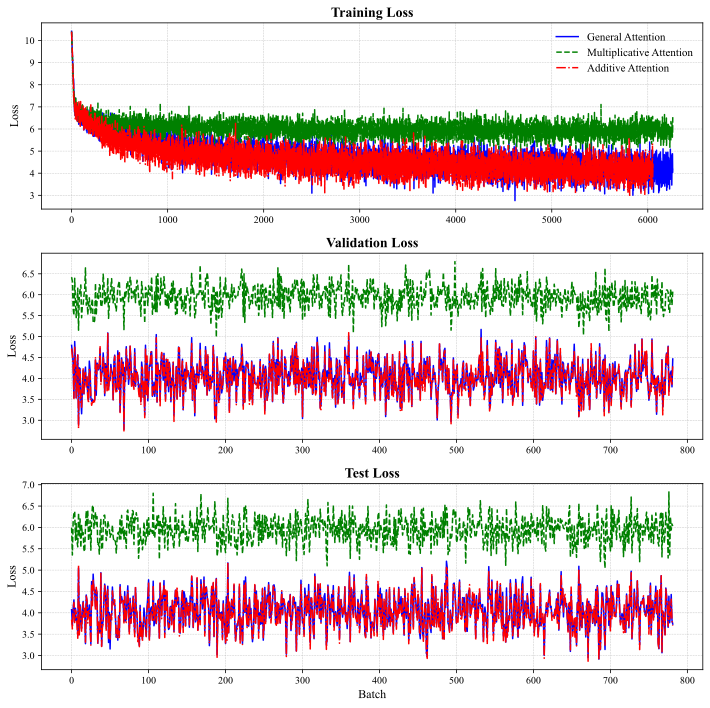
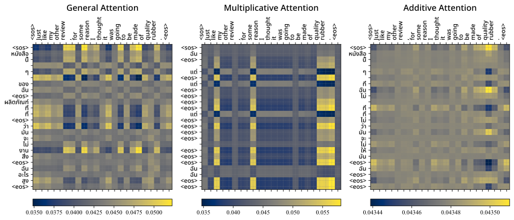

# This project...
This project explores different attention mechanisms in a Machine Translation model for translating English to Thai. By comparing General, Multiplicative, and Additive Attention, we can determine which approach balances accuracy and efficiency best.

# Demo

Before diving into the technical stuff, let’s check if our model actually works! (Fingers crossed 🤞)

# Training

## Discussion

* Dataset: I used the SCB Thai-English dataset from Hugging Face (airesearch/scb_mt_enth_2020).
    * Since I don’t have unlimited resources, I used only 50% of the dataset.
    * Sample size: Train = 100,176 | Validation = 12,522 | Test = 12,522.
    * Reformatted the dataset to convert the nested dictionary structure into a tuple format.

* Handling Thai Language:
    * Used PyThaiNLP to properly split Thai sentences into words. Unlike English, Thai has no spaces between words.

* Dealing with Errors:
    * I ran into index out of range errors (my nightmare 😅). To fix them:
        * Made sure special tokens like \<unk\>, \<pad\>, \<sos\>, and \<eos\> were included.
        * Set vocab.set_default_index(UNK_IDX) so unknown words didn’t break everything.
        * Increased max sequence length from 100 to 640 because Thai sentences can be really long!
        * Lastly, printed out almost everything for debugging!

## Results

| Attentions | Training Loss | Training PPL | Training Time | Validation Loss | Validation PPL | Validation Time |
| ---------- | ------------: | -----------: | ------------: | --------------: | -------------: | --------------: |
|General Attention|4.757|116.448|59m 35s|4.045|57.133|2m 23s|
|Multiplicative Attention|6.038|418.892|1h 35s|5.950|383.613|2m 25s|
|Additive Attention|4.491|89.191|7h 41s|4.020|55.704|13m 49s|

**It means:**
* General and Additive Attention worked best.
* Multiplicative Attention struggled—its loss is way too high!
* Additive Attention took forever to train but performed well. Some batches were even skipped because they took so long.

**Some insights from the plot:**
* Loss went down—good sign!
* Multiplicative Attention had the worst loss, so it might not be a good choice.
* Validation loss stayed stable, meaning our model isn’t completely overfitting.

# Attention Map

These charts show what words the model focused on while translating. Hopefully, they make sense!

**Interpretation:**

* General Attention: Spreads focus across different words. Captures meaning well (not in this example).
* Multiplicative Attention: Focuses on just a few words. Might miss some context.
* Additive Attention: Looks well-distributed which helps understand longer sentences better.

**Conclusion**: Additive Attention is the most detailed, but it’s also the slowest.

# Final Thoughts

* **General Attention** is a good balance between speed and accuracy.
* **Multiplicative Attention** doesn’t work well here — needs more tuning.
* **Additive Attention** is the most accurate but takes too long to train.